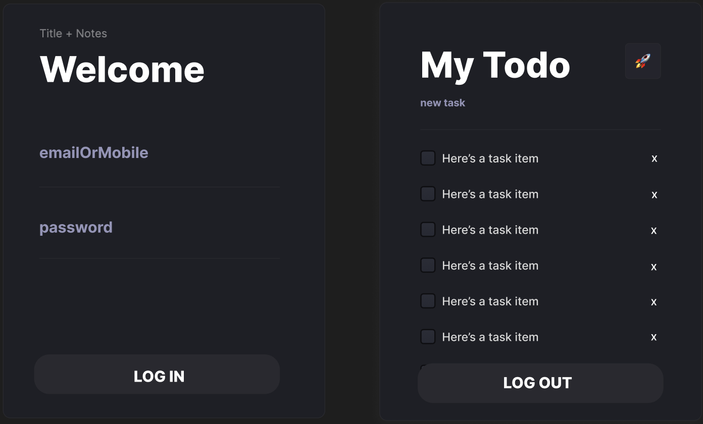
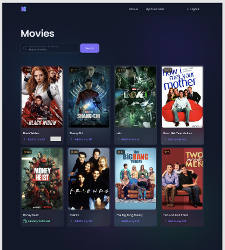

[](https://classroom.github.com/a/jSO1-bHP)

# Template-React-Todolist

[![Review Assignment Due Date]

# React Assessment : My Todo / Movie List (CC18)

### Overview

Please follow these conditions before code!

- Programming Language
  - Javascript or TypeScript
- Technologies
  - Javascript DOM, ReactJs, ViteJs, NextJs, Node.js
  - CSS Framework : Tailwind, daysiui
- API calling with method POST, GET, PATCH, DELETE for todo listing.
- Create React component
- Create page atleast 2 page
- Use React Hooks

  - useState
  - useEffect

- Bonus point (read more in [Bonus](#Bonus) section)
  - Create React component
    - High Order Components
  - Create Routing 2 page /login, /list
    - createBrowserRouter and RouterProvider
  - Create State management (context or redux)
  - Use Other Hooks
    - useNavigate
    - useParams

# Instruction

- Choose 1 of 4 Way of your assessment

  - v0 : todoList with json server
  - v1 : todoList with unsecure api
  - v2 : todoList with secure api
  - v3 : movieList with secure api

- understand your figma & Design
- understand your api doc

# APIs Document

#### https://documenter.getpostman.com/view/32045638/2sAXjQ19wi#26428d4c-92d0-4291-b924-b5679b3f5905

```js
// You can use this function for getMe
async function getMe() {
  let token; // get token from somewhere
  const res = await fetch("base_url/auth/me", {
    headers: {
      Authorization: `Bearer ${token}`, // put your token here
    },
  });
  const data = await res.json();
  console.log(data);
}
```

# Example UI For Todo List

[Figma TODO LIST CLICK!](<https://www.figma.com/design/l2BoEPvpYrw31tlbuIU0Si/Todo-List-for-Figma-projects-(Community)-(CodeCamp18)?node-id=1-230&t=KKQl0d0IuPCS95QA-1>)



# Example UI For Movie List

[Figma Movie LIST CLICK!](<https://www.figma.com/design/QNAcbHHZcJuAoje0d2jnI2/Movie-Listing-Web-App-(Community)-(CodeCamp18)?node-id=401-6827&t=Cx2PE7cHxtukyXET-1>)



# Instruction

- Section 1 (Part1-Part2) : ทำ App ได้
- Section 2 (Part3 : Bonus) : ทำให้ App ทำงานได้ดี

## Part-1 : Project Setup and UI (50pts)

### 1A : Project Setup การติดตั้งโปรเจกต์ (10 คะแนน)

      สร้างโปรเจกต์ด้วย Create React App หรือ ViteJs

- [x] Create Project with Create React App or ViteJs

      ล้างไฟล์และโค้ดที่ไม่ได้ใช้ออก

- [x] Clean up unused files and code

      ติดตั้ง dependencies หรือแพ็กเกจที่ต้องใช้ในโปรเจกต์

- [x] Install dependencies or packages that you need for this project

      เลือกและติดตั้งเฟรมเวิร์ก CSS เช่น Bootstrap, Tailwind, Scss, Vanilla CSS หรือ MUI

- [x] Pick some CSS Framework and Install eg. Bootstrap, Tailwind, Scss, Vanilla css or MUI

      จัดโครงสร้างโฟลเดอร์ให้เป็นระเบียบเรียบร้อย

- [x] Setup Well-organized Folder Structure

      ใช้ Git และ GitHub สำหรับระบบควบคุมเวอร์ชัน

- [x] Using Git and Github for Version Control System

      ใช้ Command Line ในการรันโปรเจกต์

- [x] Using Comand Line for run project

### 1B : Build UI with React Component สร้าง UI ด้วย React Component (20 คะแนน)

      เข้าใจการออกแบบ UI และ Flow ของ UI (Figma)

- [ ] Understand UI Design and UI Flow (Figma)

      เขียน UI ที่สะอาดและนำกลับมาใช้ซ้ำได้

- [ ] Write Clean & Reausable UI

      ตั้งชื่อ component ให้เหมาะสม

- [ ] Good Naming for Component

### 1C : Precise UI with Design (20pts)

      สร้าง UI ที่ถูกต้อง: หน้า Login

- [ ] Precise UI : Login Page

      สร้าง UI ที่ถูกต้อง: หน้า Todo หรือ movie (My Favorite List)

- [ ] Precise UI : Todo Page or movie (My Favorite List)

## Part-2 : Feature and Logic ฟีเจอร์และลอจิก (50 คะแนน)

### 2A : Auth and Login การยืนยันตัวตนและเข้าสู่ระบบ (15 คะแนน)

      เข้าสู่ระบบด้วยอีเมลและรหัสผ่าน

- [ ] Login with email and password

      สามารถส่งแบบฟอร์มด้วยปุ่ม Enter หรือปุ่ม

- [ ] Can submit form with Enter key or Button

      ใช้การจัดการสถานะสำหรับหน้า Login

- [ ] Implement State Management for Login Page

      เชื่อมต่อกับ API

- [ ] Connect to API

      สามารถเข้าสู่ระบบได้

- [ ] Can Login

### 2B : List Manipulate (35pts)

      แสดงรายการเมื่อหน้าเรนเดอร์ (จัดการสถานะ & API)

- [ ] Show List when Render Page (State Management & API)

      สามารถสร้างรายการใหม่ (จัดการสถานะ & API)

- [ ] Can Create List item (State Management & API)

      สามารถอัปเดตรายการ (จัดการสถานะ & API)

- [ ] Can Update List item (State Management & API)

      สามารถลบรายการ (จัดการสถานะ & API)

- [ ] Can Delete List item (State Management & API)

      สามารถออกจากระบบ (จัดการสถานะ & API)

- [ ] Can Logout (State Management & API)

#### suggestion คำแนะนำ

หากคุณไม่สามารถเรียก API ได้ สามารถจำลองข้อมูลในโปรเจกต์ คุณจะได้ครึ่งคะแนน

- If you can't call API, you can mock data in your project. you will get half point.

  หากคุณไม่สามารถเข้าสู่ระบบได้ สามารถจำลองชื่อและนามสกุลเพื่อส่งไปยัง API

- If yon can't login, you can mock you firstname and lastname. for send to API.

## Part-3 : Bonus โบนัส

      ใช้การตรวจสอบความถูกต้องในหน้า Login (10 คะแนน)

- [ ] Implement Validation in Login Page (10pts)

      เพิ่มฟีเจอร์การสมัครและหน้า Register (20 คะแนน)

- [ ] Feature Register and Register Page(20pts)

      ใช้ Context หรือ zustand สำหรับการจัดการสถานะ (20 คะแนน)

- [ ] Using Context or zustand for State Management (20pts)

      ใช้ React Router สำหรับการ routing (10 คะแนน)

- [ ] Using React Router for Routing (10pts)

      เพิ่มฟีเจอร์ใหม่หรือ UI ที่น่าทึ่ง (ขึ้นอยู่กับความคิดสร้างสรรค์) (15 คะแนน)

- [ ] New Feature or Amazing UI (Depend on your creativity) (15pts)

      ป้องกันการเข้าถึงหน้าโดยไม่ได้รับอนุญาต (10 คะแนน)

- [ ] Protect Routed (10pts)

      การเปลี่ยนหน้าอัตโนมัติ (login logout) (10 คะแนน)

- [ ] Auto Redirect (10 pts)

      ใช้  API v2 หรือ v3 (C.R.U.D.) (20 คะแนน)

- [ ] use API v2 or v3 (C.R.U.D.) (20 pts)

      ใช้  moviesAPI (TIDB,OMDB) (20 คะแนน)

- [ ] use moviesAPI (TIDB,OMDB) (20 pts)

      สร้าง Movie detail page  (20 คะแนน) (สำหรับ v3)

- [ ] Completed Movie detail page (20 pts) (for v3)

      สร้าง Movie list page  (20 คะแนน) (สำหรับ v3)

- [ ] Completed Movie list page (20 pts) (for v3)
- [ ] Deploy to Vercel or Netlify (15pts)
- paste your link here

# Can and Can't

เปิด Slide, Docs, StackOverflow, Google ได้

- Open Slide , Docs , StackOverflow , Google

  ห้ามใช้ AI, ห้าม Copy, ห้ามโกง

- Don't AI , Don't Copy , Don't Cheat

  ห้ามใช้โค้ดจากโปรเจกต์อื่น (COPY PASTE)

- Don't use other code from other project (COPY PASTE)

  คุณสามารถถามเพื่อหารือได้ (ไม่ใช่ขอคำตอบ)

- You can asking for discussion (not solution)
